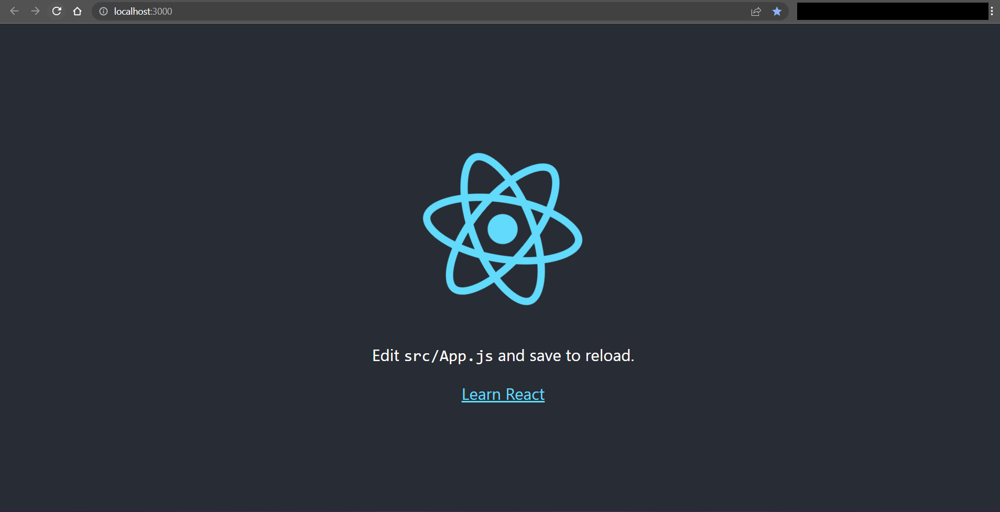
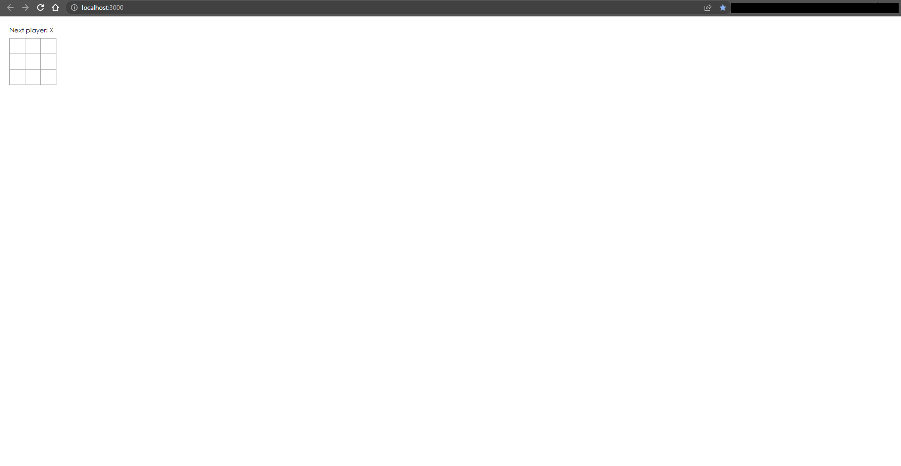

# Process

1. Start in project root directory.

1. Use `create-react-app` to create a new React app:
    * `npx create-react-app the-react-app`
        * Sample console output:

            ```console
            PS C:\Users\FlynntKnapp\Programming\react-tutorial> npx create-react-app the-react-app
            Need to install the following packages:
              create-react-app@5.0.1
            Ok to proceed? (y) y
            npm WARN deprecated tar@2.2.2: This version of tar is no longer supported, and will not receive security updates. Please upgrade asap.
            
            Creating a new React app in C:\Users\FlynntKnapp\Programming\react-tutorial\the-react-app.
            
            Installing packages. This might take a couple of minutes.
            Installing react, react-dom, and react-scripts with cra-template...
            
            
            added 1397 packages in 45s
            
            214 packages are looking for funding
              run `npm fund` for details
            
            Installing template dependencies using npm...
            
            added 71 packages in 8s
            
            226 packages are looking for funding
              run `npm fund` for details
            Removing template package using npm...
            
            
            removed 1 package, and audited 1468 packages in 4s
            
            226 packages are looking for funding
              run `npm fund` for details
            
            10 high severity vulnerabilities
            
            To address all issues (including breaking changes), run:
              npm audit fix --force
            
            Run `npm audit` for details.
            
            Success! Created the-react-app at C:\Users\FlynntKnapp\Programming\react-tutorial\the-react-app
            Inside that directory, you can run several commands:
            
              npm start
                Starts the development server.
            
              npm run build
                Bundles the app into static files for production.
            
              npm test
                Starts the test runner.
            
              npm run eject
                Removes this tool and copies build dependencies, configuration files
                and scripts into the app directory. If you do this, you can’t go back!
            
            We suggest that you begin by typing:
            
              cd the-react-app
              npm start
            
            Happy hacking!
            PS C:\Users\FlynntKnapp\Programming\react-tutorial>
            ```

1. Test current Default React App starter code in browser:

    1. Change directory into the React app directory:
        * `Set-Location the-react-app`

    1. Inspect directory contents:
        * `Get-ChildItem`
            * Sample console output:

                ```console
                PS C:\Users\FlynntKnapp\Programming\react-tutorial\the-react-app> Get-ChildItem     
                
                    Directory: C:\Users\FlynntKnapp\Programming\react-tutorial\the-react-app
                
                Mode                 LastWriteTime         Length Name
                ----                 -------------         ------ ----
                d----            1/1/2023 10:15 AM                node_modules
                d----            1/1/2023 10:15 AM                public
                d----            1/1/2023 10:15 AM                src
                -a---            1/1/2023 10:14 AM            310 .gitignore
                -a---            1/1/2023 10:15 AM         665868 package-lock.json
                -a---            1/1/2023 10:15 AM            816 package.json
                -a---            1/1/2023 10:14 AM           3359 README.md
                
                PS C:\Users\FlynntKnapp\Programming\react-tutorial\the-react-app>
                ```

    1. Start the server:
        * `npm start`
            * Sample console output:

                ```console
                PS C:\Users\FlynntKnapp\Programming\react-tutorial\the-react-app> npm start

                > the-react-app@0.1.0 start
                > react-scripts start

                (node:13748) [DEP_WEBPACK_DEV_SERVER_ON_AFTER_SETUP_MIDDLEWARE] DeprecationWarning: 'onAfterSetupMiddleware' option is deprecated. Please use the 'setupMiddlewares' option.
                (Use `node --trace-deprecation ...` to show where the warning was created)
                (node:13748) [DEP_WEBPACK_DEV_SERVER_ON_BEFORE_SETUP_MIDDLEWARE] DeprecationWarning: 'onBeforeSetupMiddleware' option is deprecated. Please use the 'setupMiddlewares' option.
                Starting the development server...
                Compiled successfully!

                You can now view the-react-app in the browser.

                  Local:            http://localhost:3000
                  On Your Network:  http://192.168.0.8:3000

                Note that the development build is not optimized.
                To create a production build, use npm run build.

                webpack compiled successfully
                ```

    1. The app opens the browser to the URL displayed in the console output:
        * <http://localhost:3000/>
        * Sample browser image:

            

1. Remove content of [`the-react-app/src/`](../the-react-app/src/) directory.

1. Create a new file in the [`the-react-app/src/`](../the-react-app/src/) directory named `index.js`:
    * `New-Item -Path src\index.js -ItemType File`:
        * Sample console output:

            ```console
            PS C:\Users\FlynntKnapp\Programming\react-tutorial\the-react-app> New-Item -Path src\index.js -ItemType File
            
            
                Directory: C:\Users\FlynntKnapp\Programming\react-tutorial\the-react-app\src
            
            
            Mode                 LastWriteTime         Length Name
            ----                 -------------         ------ ----
            -a---            1/1/2023 10:15 AM              0 index.js
            
            
            PS C:\Users\FlynntKnapp\Programming\react-tutorial\the-react-app>
            ```

1. Create a new file in the [`the-react-app/src/`](../the-react-app/src/) directory named `index.css`:
    * `New-Item -Path src\index.css -ItemType File`:
        * Sample console output:

            ```console
            PS C:\Users\FlynntKnapp\Programming\react-tutorial\the-react-app> New-Item -Path src\index.css -ItemType File
            
            
                Directory: C:\Users\FlynntKnapp\Programming\react-tutorial\the-react-app\src
            
            
            Mode                 LastWriteTime         Length Name
            ----                 -------------         ------ ----
            -a---            1/1/2023 10:15 AM              0 index.css
            
            
            PS C:\Users\FlynntKnapp\Programming\react-tutorial\the-react-app>
            ```

1. Add content to [`the-react-app/src/index.js`](../the-react-app/src/index.js):
    * Sample code:

        ```javascript
        import React from 'react';
        import ReactDOM from 'react-dom/client';
        import './index.css';

        class Square extends React.Component {
            render() {
                return (
                    <button className="square">
                        {/* TODO */}
                    </button>
                );
            }
        }

        class Board extends React.Component {
            renderSquare(i) {
                return <Square />;
            }

            render() {
                const status = 'Next player: X';

                return (
                    <div>
                        <div className="status">{status}</div>
                        <div className="board-row">
                            {this.renderSquare(0)}
                            {this.renderSquare(1)}
                            {this.renderSquare(2)}
                        </div>
                        <div className="board-row">
                            {this.renderSquare(3)}
                            {this.renderSquare(4)}
                            {this.renderSquare(5)}
                        </div>
                        <div className="board-row">
                            {this.renderSquare(6)}
                            {this.renderSquare(7)}
                            {this.renderSquare(8)}
                        </div>
                    </div>
                );
            }
        }

        class Game extends React.Component {
            render() {
                return (
                    <div className="game">
                        <div className="game-board">
                            <Board />
                        </div>
                        <div className="game-info">
                            <div>{/* status */}</div>
                            <ol>{/* TODO */}</ol>
                        </div>
                    </div>
                );
            }
        }

        // ========================================

        const root = ReactDOM.createRoot(document.getElementById("root"));
        root.render(<Game />);
        ```

1. Start server to test current app configuration:
    * `npm start`:
        * Sample console output:

            ```console
            PS C:\Users\FlynntKnapp\Programming\react-tutorial\the-react-app> npm start

            > the-react-app@0.1.0 start
            > react-scripts start

            (node:20900) [DEP_WEBPACK_DEV_SERVER_ON_AFTER_SETUP_MIDDLEWARE] DeprecationWarning: 'onAfterSetupMiddleware' option is deprecated. Please use the 'setupMiddlewares' option.
            (Use `node --trace-deprecation ...` to show where the warning was created)
            (node:20900) [DEP_WEBPACK_DEV_SERVER_ON_BEFORE_SETUP_MIDDLEWARE] DeprecationWarning: 'onBeforeSetupMiddleware' option is deprecated. Please use the 'setupMiddlewares' option.
            Starting the development server...
            Compiled successfully!

            You can now view the-react-app in the browser.

              Local:            http://localhost:3000
              On Your Network:  http://192.168.0.8:3000

            Note that the development build is not optimized.
            To create a production build, use npm run build.

            webpack compiled successfully
            ```

1. Sample browser image:

    

1. Current step in guide:
    * <https://reactjs.org/tutorial/tutorial.html#what-is-react>
