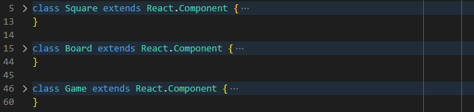

# Notes

1. Create a React App:
    * `npx create-react-app my-app`
    * Sample console output:

        ```console
        PowerShell 7.3.1
        PS C:\Users\FlynntKnapp\Programming> cd .\react-tutorial\paths\tutorial-path\
        PS C:\Users\FlynntKnapp\Programming\react-tutorial\paths\tutorial-path> npx create-react-app my-app

        Creating a new React app in C:\Users\FlynntKnapp\Programming\react-tutorial\paths\tutorial-path\my-app.

        Installing packages. This might take a couple of minutes.
        Installing react, react-dom, and react-scripts with cra-template...


        added 1397 packages in 35s

        214 packages are looking for funding
        run `npm fund` for details

        Installing template dependencies using npm...

        added 71 packages in 15s

        226 packages are looking for funding
        run `npm fund` for details
        Removing template package using npm...


        removed 1 package, and audited 1468 packages in 2s

        226 packages are looking for funding
        run `npm fund` for details

        6 high severity vulnerabilities

        To address all issues (including breaking changes), run:
        npm audit fix --force

        Run `npm audit` for details.

        Success! Created my-app at C:\Users\FlynntKnapp\Programming\react-tutorial\paths\tutorial-path\my-app
        Inside that directory, you can run several commands:

        npm start
            Starts the development server.

        npm run build
            Bundles the app into static files for production.

        npm test
            Starts the test runner.

        npm run eject
            Removes this tool and copies build dependencies, configuration files
            and scripts into the app directory. If you do this, you can’t go back!

        We suggest that you begin by typing:

        cd my-app
        npm start

        Happy hacking!
        PS C:\Users\FlynntKnapp\Programming\react-tutorial\paths\tutorial-path>
        ```

1. Change directory to the new app's directory:
    * `cd my-app`
    * Sample console output:

        ```console
        PS C:\Users\FlynntKnapp\Programming\react-tutorial\paths\tutorial-path> cd my-app
        PS C:\Users\FlynntKnapp\Programming\react-tutorial\paths\tutorial-path\my-app>
        ```

1. Test run app:
    * `nmp start`
    * Sample console output:

        ```console
        PS C:\Users\FlynntKnapp\Programming\react-tutorial\paths\tutorial-path\my-app> npm start

        > my-app@0.1.0 start
        > react-scripts start

        (node:2708) [DEP_WEBPACK_DEV_SERVER_ON_AFTER_SETUP_MIDDLEWARE] DeprecationWarning: 'onAfterSetupMiddleware' option is deprecated. Please use the 'setupMiddlewares' option.
        (Use `node --trace-deprecation ...` to show where the warning was created)
        (node:2708) [DEP_WEBPACK_DEV_SERVER_ON_BEFORE_SETUP_MIDDLEWARE] DeprecationWarning: 'onBeforeSetupMiddleware' option is deprecated. Please use the 'setupMiddlewares' option.
        Starting the development server...
        Compiled successfully!

        You can now view my-app in the browser.

          Local:            http://localhost:3000
          On Your Network:  http://192.168.0.8:3000

        Note that the development build is not optimized.
        To create a production build, use npm run build.

        webpack compiled successfully
        ```

1. Stop the app:
    * `Ctrl+C`
    * Sample console output:

        ```console
        Terminate batch job (Y/N)? y
        PS C:\Users\FlynntKnapp\Programming\react-tutorial\paths\tutorial-path\my-app>
        ```

1. Remove contents of [`my-app/src/`](../my-app/src/).

1. Create [`my-app/src/index.js`](../my-app/src/index.js) file with following contents:
    * Sample code:

        ```js
        import React from 'react';
        import ReactDOM from 'react-dom/client';
        import './index.css';

        class Square extends React.Component {
            render() {
                return (
                    <button className="square">
                        {/* TODO */}
                    </button>
                );
            }
        }

        class Board extends React.Component {
            renderSquare(i) {
                return <Square />;
            }

            render() {
                const status = 'Next player: X';

                return (
                    <div>
                        <div className="status">{status}</div>
                        <div className="board-row">
                            {this.renderSquare(0)}
                            {this.renderSquare(1)}
                            {this.renderSquare(2)}
                        </div>
                        <div className="board-row">
                            {this.renderSquare(3)}
                            {this.renderSquare(4)}
                            {this.renderSquare(5)}
                        </div>
                        <div className="board-row">
                            {this.renderSquare(6)}
                            {this.renderSquare(7)}
                            {this.renderSquare(8)}
                        </div>
                    </div>
                );
            }
        }

        class Game extends React.Component {
            render() {
                return (
                    <div className="game">
                        <div className="game-board">
                            <Board />
                        </div>
                        <div className="game-info">
                            <div>{/* status */}</div>
                            <ol>{/* TODO */}</ol>
                        </div>
                    </div>
                );
            }
        }

        // ========================================

        const root = ReactDOM.createRoot(document.getElementById("root"));
        root.render(<Game />);
        ```

1. Create [`my-app/src/index.css`](../my-app/src/index.css) with following contents:
    * Sample code:

    ```css
    body {
    font: 14px "Century Gothic", Futura, sans-serif;
    margin: 20px;
    }

    ol, ul {
    padding-left: 30px;
    }

    .board-row:after {
    clear: both;
    content: "";
    display: table;
    }

    .status {
    margin-bottom: 10px;
    }

    .square {
    background: #fff;
    border: 1px solid #999;
    float: left;
    font-size: 24px;
    font-weight: bold;
    line-height: 34px;
    height: 34px;
    margin-right: -1px;
    margin-top: -1px;
    padding: 0;
    text-align: center;
    width: 34px;
    }

    .square:focus {
    outline: none;
    }

    .kbd-navigation .square:focus {
    background: #ddd;
    }

    .game {
    display: flex;
    flex-direction: row;
    }

    .game-info {
    margin-left: 20px;
    }
    ```

1. Note the three React components:

    

    * `Square`
    * `Board`
    * `Game`

1. Modify the `Square` component to display the value of the `i` via the `theFirstPropsVariable` prop:
    * Sample code:

        ```js
        class Square extends React.Component {
            render() {
                return (
                    <button className="square">
                        {this.props.theFirstPropsVariable}
                    </button>
                );
            }
        }
        ```

1. Modify the `Board` component to pass the value of `i` to the `Square` component prop `theFirstPropsVariable`:
    * Sample code:

        ```js
        class Board extends React.Component {
            //...
            renderSquare(i) {
                return <Square theFirstPropsVariable={i}/>;
            }
            //...
        }
        ```

1. Add interactivity to the `Square` component:
    * Sample code:

        ```js
        class Square extends React.Component {
            render() {
                return (
                    <button
                        className="square"
                        onClick={function() { console.log('Clicked!'); }}
                        >
                        {this.props.theFirstPropsVariable}
                    </button>
                );
            }
        }
        ```

1. Modify the `Square` component to use an arrow function:
    * Sample code:

        ```js
        class Square extends React.Component {
            render() {
                return (
                    <button
                        className="square"
                        onClick={() => console.log('Clicked!')}
                        >
                        {this.props.theFirstPropsVariable}
                    </button>
                );
            }
        }
        ```

1. Add contructor to `Square` component to initialize the state:
    * Sample code:

        ```js
        class Square extends React.Component {
            constructor(props) {
                super(props);
                this.state = {
                    value: null,
                };
            }
            //...
        }
        ```

1. Modify the `render` method of the `Square` component to display the current state's value:
    * Sample code:

        ```js
        class Square extends React.Component {
            //...
            render() {
                return (
                    <button
                        className="square"
                        onClick={() => {
                            console.log('Clicked!', this.props.theFirstPropsVariable);
                            this.setState({ theFirstStateVariable: 'X' });
                        }}
                        >
                        {this.state.theFirstStateVariable}
                    </button>
                );
            }
            //...
        }
        ```

1. <https://reactjs.org/tutorial/tutorial.html#why-immutability-is-important>
